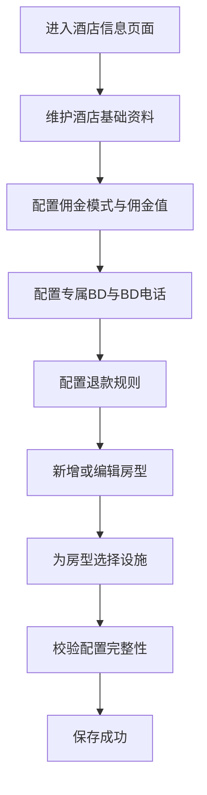
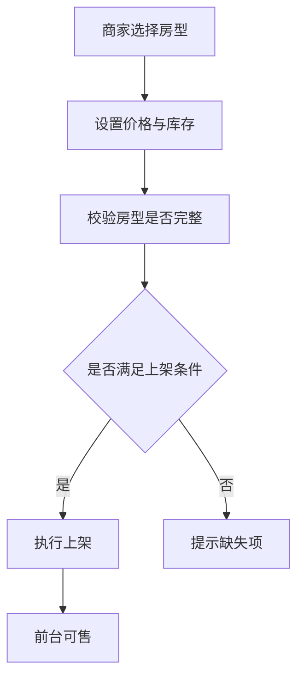
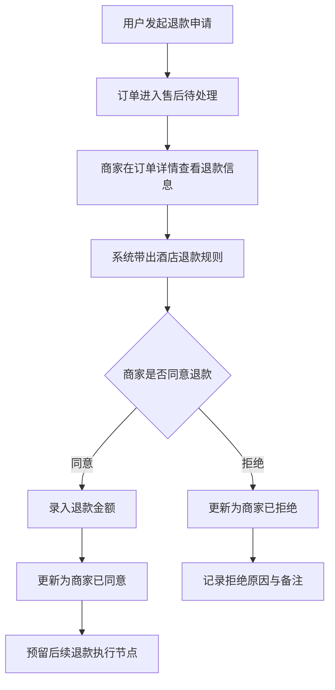
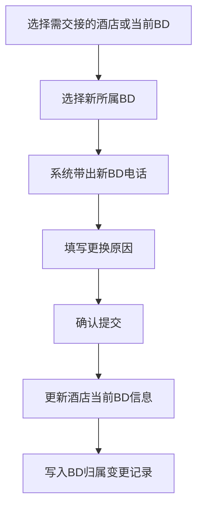

# 酒店商家端管理方案设计文档

## 1. 文档目标

本文档用于规划若依管理系统中的酒店商家端业务模块，面向单店商家场景，输出开发前的菜单结构、业务边界、核心流程、数据模型、状态设计、权限点与若依落地方案，作为后续进入开发阶段的正式评审稿。

本次重构重点解决以下业务调整：

- 将退款能力从独立菜单调整为酒店订单内的订单操作能力
- 在酒店配置中补充佣金配置、专属 BD、BD 电话、退款规则
- 增加一键更换酒店所属 BD 菜单，用于 BD 离职或交接场景
- 统一酒店配置、订单售后、经营管理之间的业务逻辑，避免前后术语与流程不一致

## 2. 适用范围

当前方案适用于以下业务前提：

- 一个商家仅管理一家酒店
- 一家酒店下维护多个房型
- 商家可维护酒店资料、房型设施、房型价格、库存、上下架与订单退款处理
- 平台需维护酒店与 BD 的归属关系，并支持交接调整
- 退款先按订单内审核处理设计，不先扩展复杂财务结算能力

## 3. 建设目标

在若依管理系统中新增酒店商家端一级业务菜单，围绕以下业务方向建设：

- 配置酒店
- 管理酒店
- 酒店订单
- BD 归属调整

系统建设目标如下：

- 支持商家维护酒店基础资料、佣金模式、专属 BD 信息与退款规则
- 支持商家维护房型档案与房型设施
- 支持商家对房型进行库存、价格、上下架管理
- 支持商家在酒店订单中处理退款申请，支持是否退款与退款金额控制
- 支持平台快速调整酒店所属 BD，满足离职、转岗、交接场景
- 在第一阶段控制复杂度，同时为后续多店、按日房态、支付联动退款预留扩展空间

---

## 4. 总体菜单结构设计

### 4.1 业务表达型菜单结构

该结构更符合业务方表达习惯：

```text
酒店管理
├─ 配置酒店
│  ├─ 酒店信息
│  ├─ 佣金与归属配置
│  ├─ 房型管理
│  └─ 设施配置
├─ 管理酒店
│  ├─ 房型经营
│  └─ 库存价格管理
├─ 酒店订单
│  ├─ 订单列表
│  └─ 退款处理
└─ 更换所属BD
```

### 4.2 系统实现型菜单结构

该结构更适合若依页面、权限、接口拆分：

```text
酒店管理
├─ 酒店信息
├─ 佣金与归属配置
├─ 房型管理
├─ 库存价格管理
├─ 酒店订单
└─ 更换所属BD
```

### 4.3 推荐方案

建议采用业务表达型作为需求讨论口径，采用系统实现型作为若依最终落地结构。

原因如下：

- 业务方更容易理解配置酒店、经营管理、订单售后、BD 归属调整的分层
- 研发更容易按页面拆分菜单、权限、控制器与接口
- 退款作为订单售后能力，放入酒店订单更符合操作入口习惯
- 后续若新增按日房态、订单改签、退款复核，也能较平滑扩展

---

## 5. 业务边界定义

### 5.1 本期纳入范围

- 酒店基础资料维护
- 酒店佣金配置维护
- 酒店专属 BD 与 BD 电话维护
- 酒店退款规则维护
- 房型档案维护
- 房型设施配置
- 房型默认价格管理
- 房型默认库存管理
- 房型上下架管理
- 酒店订单查询
- 订单退款审核与处理
- 酒店所属 BD 一键更换

### 5.2 本期不纳入范围

- 多店商家管理
- 连锁酒店组织架构
- 复杂促销与套餐
- 渠道分销
- 自动退款打款
- 财务结算中心
- 实时房态对接外部渠道
- 平台级复核中心
- BD 绩效结算规则

### 5.3 扩展预留范围

- 单店升级为多店
- 按日期维度管理房态库存与价格
- 退款自动规则判定
- 商家退款后平台复核
- 退款状态对接支付网关
- 基于佣金模式的自动结算
- BD 历史归属轨迹与交接审批

---

## 6. 业务对象定义

为避免概念混乱，建议在项目中统一以下对象定义：

### 6.1 酒店

酒店是商家经营主体，在单店模式下与商家账号形成一对一关系，同时挂接佣金规则、专属 BD 和退款规则等平台管理属性。

### 6.2 房型

房型是酒店售卖资源的基础档案，负责描述房间的静态属性，例如床型、面积、图片、可住人数与设施。

### 6.3 房态

房态是房型在某个业务日期下的动态售卖状态，负责承载库存、价格、可售状态等经营数据。

### 6.4 酒店订单

酒店订单是用户预订酒店后形成的交易单据，承载入住信息、金额信息、履约状态、售后状态等。

### 6.5 退款单

退款单是订单售后申请记录，作为酒店订单的售后对象存在，承载退款申请金额、可退金额、实际退款金额、审核状态与处理备注。

### 6.6 BD 归属

BD 归属是酒店与平台商务人员之间的负责关系，用于标识当前酒店的专属 BD、联系方式及历史交接信息。

---

## 7. 模块设计

## 7.1 配置酒店

配置酒店模块用于完成酒店基础信息、经营规则与房型基础档案配置，是后续经营动作的前置条件。

### 7.1.1 酒店信息

#### 页面目标

维护酒店基础经营资料与经营规则。

#### 页面字段建议

- 酒店名称
- 酒店封面图
- 酒店轮播图
- 联系电话
- 省市区
- 详细地址
- 经纬度
- 入住时间
- 离店时间
- 酒店简介
- 预订须知
- 开票说明
- 停车说明
- 酒店经营状态
- 佣金模式
- 佣金值
- 专属 BD
- BD 电话
- 退款规则
- 限时退款截止条件
- 退款规则说明

#### 佣金配置说明

建议在酒店配置中提供独立的佣金板块，支持以下两种模式：

- 底价模式：平台维护或约定底价，商家售卖价高于底价部分按业务规则处理
- 卖价模式：直接基于售卖价配置佣金口径，便于后续统一结算扩展

本期先定义模式与字段，不展开复杂财务结算公式。

#### BD 配置说明

酒店配置中需明确专属 BD 与 BD 电话，用于商家联系、平台跟进与内部归属识别。

#### 退款规则说明

酒店配置中需明确默认退款规则，建议支持以下三类：

- 限时退
- 不可退
- 任意退

若选择限时退，需补充截止时间规则，例如入住前一天 18 点前可退。

#### 交互要求

- 单店商家进入页面后直接维护自身酒店信息
- 若未创建酒店资料，可进入初始化录入状态
- 保存前需校验酒店名称、联系电话、地址、入住时间、离店时间等必填项
- 佣金模式、专属 BD、BD 电话、退款规则为必填配置项
- 当退款规则为限时退时，必须填写限时退条件

### 7.1.2 房型管理

#### 页面目标

维护酒店房型基础档案。

#### 页面字段建议

- 房型名称
- 房型编码
- 房型图片
- 床型
- 可住人数
- 房间面积
- 楼层描述
- 窗型
- 早餐数量
- 是否可加床
- 房型描述
- 房型配置状态
- 排序号
- 备注

#### 页面操作建议

- 列表查询
- 新增房型
- 编辑房型
- 查看详情
- 启用停用
- 删除未经营房型

#### 业务规则建议

- 同一酒店下房型名称不可重复
- 房型编码不可重复
- 已关联订单或经营数据的房型不可直接物理删除，建议改为停用

### 7.1.3 设施配置

#### 页面目标

对房型绑定设施信息，形成标准化展示与筛选能力。

#### 配置方式建议

设施应采用标准字典模式，不建议直接在房型表中冗余多个设施字段。

建议设施类型：

- 房间设施
- 卫浴设施
- 公共设施
- 服务设施

#### 典型设施项

- WiFi
- 空调
- 独立卫浴
- 热水
- 电视
- 吹风机
- 洗漱用品
- 免费停车
- 电梯
- 早餐

#### 页面操作建议

- 查询设施分类
- 选择房型
- 勾选设施
- 批量保存

---

## 7.2 管理酒店

管理酒店模块用于商家进行日常经营管理，重点是房型售卖能力控制。

### 7.2.1 房型经营

#### 页面目标

将已完成配置的房型投入经营管理。

#### 经营维度建议

- 默认售价
- 默认库存
- 是否可预订
- 上架状态
- 配置完整度提示

#### 页面操作建议

- 查看房型当前经营摘要
- 设置默认销售价格
- 设置默认库存数量
- 设置是否上架
- 设置是否允许预订

#### 业务规则建议

- 房型未完成基础配置时不能上架
- 默认库存小于等于零时不可售
- 默认价格为空时不可上架

### 7.2.2 库存价格管理

#### 页面目标

对房型进行库存与价格调整，是酒店经营核心页面。

#### 第一阶段建议能力

为控制复杂度，第一阶段建议实现以下能力：

- 按房型维护默认库存
- 按房型维护默认售价
- 支持临时调整库存
- 支持临时调整价格
- 支持房型快速停售

#### 第二阶段建议能力

若后续业务增长，建议扩展为按日期维度管理：

- 选择日期区间
- 按日期批量调价
- 按日期批量调库存
- 配置某日是否可售
- 展示已售、剩余与满房状态

#### 建议页面字段

- 房型名称
- 销售价
- 划线价
- 默认库存
- 已售数量
- 剩余可售
- 售卖状态
- 更新时间

---

## 7.3 酒店订单

酒店订单模块用于商家查看订单、处理履约与执行退款操作。退款不再作为独立菜单，而是订单中的售后处理能力。

### 7.3.1 订单列表

#### 页面目标

提供酒店订单查询、状态筛选与售后操作入口。

#### 页面字段建议

- 订单编号
- 入住人
- 联系电话
- 房型名称
- 入住日期
- 离店日期
- 订单金额
- 实付金额
- 订单状态
- 售后状态
- 可退款金额
- 下单时间
- 支付时间

#### 查询条件建议

- 订单编号
- 订单状态
- 售后状态
- 下单时间范围
- 入住日期范围
- 房型名称
- 联系电话

#### 页面操作建议

- 查看详情
- 查看退款记录
- 发起退款处理
- 同意退款
- 拒绝退款
- 填写处理备注

### 7.3.2 退款处理

#### 页面目标

在订单详情内完成退款审核与处理。

#### 页面展示建议

- 订单基础信息
- 房型与入住信息
- 支付金额
- 可退款金额
- 已退款金额
- 申请退款金额
- 建议退款规则
- 当前酒店退款规则
- 退款原因
- 商家处理备注

#### 页面操作建议

- 查看详情
- 同意退款
- 拒绝退款
- 录入退款金额
- 填写审核备注

#### 业务规则建议

- 商家可操作是否退款以及退款金额
- 实际退款金额不得大于订单可退款金额
- 若已存在部分退款，则本次退款金额不得超过剩余可退款金额
- 同意退款与拒绝退款必须记录处理人和处理时间
- 拒绝退款时审核备注必填
- 当酒店退款规则为不可退时，页面默认提示不可退，但保留人工干预能力
- 若后续要接支付退款，同意退款后状态应进入待退款或退款处理中

---

## 7.4 更换所属 BD

更换所属 BD 模块用于在 BD 离职、调岗、区域重分配时快速完成酒店归属交接。

### 7.4.1 页面目标

提供酒店与 BD 的快速归属调整能力，避免逐个编辑酒店信息导致效率低下。

### 7.4.2 页面字段建议

- 酒店名称
- 当前所属 BD
- 当前 BD 电话
- 新所属 BD
- 新 BD 电话
- 更换原因
- 生效时间
- 操作人
- 操作时间

### 7.4.3 页面操作建议

- 按酒店筛选
- 按当前 BD 筛选
- 单酒店更换所属 BD
- 批量更换所属 BD
- 查看更换记录

### 7.4.4 业务规则建议

- 更换后酒店详情中的专属 BD 与 BD 电话同步更新
- 更换动作必须记录原 BD、新 BD、操作人、操作时间与原因
- 若支持批量更换，需校验目标酒店是否均处于可交接状态
- 更换所属 BD 不影响历史订单与历史退款责任记录，仅影响当前归属

---

## 8. 核心业务流程设计

## 8.1 酒店配置流程



### 流程说明

- 酒店资料是商家经营的基础对象
- 酒店经营规则与归属信息在酒店配置阶段一次性确定
- 房型需要在酒店资料存在后才能配置
- 房型设施配置完成后才算基础档案完整

## 8.2 房型经营流程



### 上架前校验建议

- 房型名称已配置
- 房型图片已上传
- 房型价格已设置
- 房型库存大于零
- 房型配置状态为启用

## 8.3 订单退款处理流程



### 流程说明

- 退款入口统一放在酒店订单内，避免菜单割裂
- 系统展示酒店配置中的退款规则作为处理参考
- 商家可人工判断是否退款以及退款金额
- 后续可在同一流程上叠加支付退款联动能力

## 8.4 更换所属 BD 流程



### 流程说明

- 更换所属 BD 作为独立菜单执行，服务于交接场景
- 更换成功后酒店配置页展示的 BD 信息自动同步
- 历史变更需可追溯，便于后续稽核与责任划分

---

## 9. 数据模型设计

以下为推荐的数据模型设计草案。

## 9.1 酒店表 `hotel_info`

| 字段 | 类型建议 | 说明 |
|---|---|---|
| id | bigint | 主键 |
| merchant_id | bigint | 商家编号 |
| hotel_name | varchar | 酒店名称 |
| hotel_cover | varchar | 封面图 |
| hotel_images | text | 轮播图集合 |
| phone | varchar | 联系电话 |
| province_code | varchar | 省编码 |
| city_code | varchar | 市编码 |
| district_code | varchar | 区编码 |
| address | varchar | 详细地址 |
| longitude | decimal | 经度 |
| latitude | decimal | 纬度 |
| check_in_time | varchar | 入住时间 |
| check_out_time | varchar | 离店时间 |
| intro | text | 酒店简介 |
| booking_notice | text | 预订须知 |
| invoice_desc | text | 开票说明 |
| parking_desc | text | 停车说明 |
| commission_mode | char | 佣金模式 |
| commission_value | decimal | 佣金值 |
| bd_user_id | bigint | 专属BD编号 |
| bd_name | varchar | 专属BD名称快照 |
| bd_phone | varchar | BD电话 |
| refund_rule_type | char | 退款规则类型 |
| refund_rule_desc | varchar | 退款规则说明 |
| refund_deadline_desc | varchar | 限时退款条件说明 |
| status | char | 酒店状态 |
| del_flag | char | 删除标记 |
| create_by | varchar | 创建人 |
| create_time | datetime | 创建时间 |
| update_by | varchar | 更新人 |
| update_time | datetime | 更新时间 |

### 设计说明

- 单店模式下建议对 `merchant_id` 增加唯一约束
- 地址信息建议拆分省市区编码，便于后续统计与联动
- 图集建议先以字符串集合方式处理，后续可扩展附件表
- 佣金模式、BD 信息、退款规则属于酒店经营配置，应沉淀在酒店主表或扩展表中

## 9.2 房型表 `hotel_room_type`

| 字段 | 类型建议 | 说明 |
|---|---|---|
| id | bigint | 主键 |
| hotel_id | bigint | 酒店编号 |
| merchant_id | bigint | 商家编号 |
| room_type_name | varchar | 房型名称 |
| room_type_code | varchar | 房型编码 |
| room_images | text | 房型图片集合 |
| bed_type | char | 床型 |
| people_limit | int | 可住人数 |
| area | varchar | 面积说明 |
| floor_desc | varchar | 楼层描述 |
| window_type | char | 窗型 |
| breakfast_count | int | 早餐数量 |
| extra_bed_flag | char | 是否可加床 |
| description | text | 房型描述 |
| base_price | decimal | 默认价格 |
| base_stock | int | 默认库存 |
| config_status | char | 配置状态 |
| sale_status | char | 上架状态 |
| bookable_flag | char | 是否可预订 |
| sort_num | int | 排序号 |
| remark | varchar | 备注 |
| del_flag | char | 删除标记 |
| create_by | varchar | 创建人 |
| create_time | datetime | 创建时间 |
| update_by | varchar | 更新人 |
| update_time | datetime | 更新时间 |

### 设计说明

- `config_status` 与 `sale_status` 必须分开
- `base_price` 与 `base_stock` 适合作为第一阶段默认经营字段
- 为兼容未来多店场景，建议保留 `merchant_id`

## 9.3 设施字典表 `hotel_facility`

| 字段 | 类型建议 | 说明 |
|---|---|---|
| id | bigint | 主键 |
| facility_name | varchar | 设施名称 |
| facility_type | char | 设施分类 |
| status | char | 状态 |
| sort_num | int | 排序号 |
| remark | varchar | 备注 |

### 设计说明

- 若平台已有统一字典体系，也可直接落到若依字典中维护
- 若设施后续带图标、说明、分组展示，独立表更灵活

## 9.4 房型设施关联表 `hotel_room_type_facility_rel`

| 字段 | 类型建议 | 说明 |
|---|---|---|
| id | bigint | 主键 |
| hotel_id | bigint | 酒店编号 |
| room_type_id | bigint | 房型编号 |
| facility_id | bigint | 设施编号 |

### 设计说明

- 同一房型与设施应增加唯一约束
- 可按房型批量删除后重建关联

## 9.5 房态库存价格表 `hotel_room_inventory`

| 字段 | 类型建议 | 说明 |
|---|---|---|
| id | bigint | 主键 |
| hotel_id | bigint | 酒店编号 |
| merchant_id | bigint | 商家编号 |
| room_type_id | bigint | 房型编号 |
| biz_date | date | 业务日期 |
| stock_num | int | 库存数量 |
| sold_num | int | 已售数量 |
| available_num | int | 剩余可售 |
| sale_price | decimal | 销售价 |
| market_price | decimal | 划线价 |
| sale_status | char | 可售状态 |
| create_time | datetime | 创建时间 |
| update_time | datetime | 更新时间 |

### 设计说明

- 第一阶段即使不启用日历房态，也建议预留该表设计
- `available_num` 可实时计算，也可冗余存储后通过更新逻辑维护

## 9.6 酒店订单表 `hotel_order`

| 字段 | 类型建议 | 说明 |
|---|---|---|
| id | bigint | 主键 |
| order_no | varchar | 订单号 |
| hotel_id | bigint | 酒店编号 |
| merchant_id | bigint | 商家编号 |
| room_type_id | bigint | 房型编号 |
| contact_name | varchar | 入住人或联系人 |
| contact_phone | varchar | 联系电话 |
| check_in_date | date | 入住日期 |
| check_out_date | date | 离店日期 |
| order_amount | decimal | 订单金额 |
| pay_amount | decimal | 实付金额 |
| refunded_amount | decimal | 已退款金额 |
| refundable_amount | decimal | 剩余可退款金额 |
| order_status | char | 订单状态 |
| after_sale_status | char | 售后状态 |
| pay_time | datetime | 支付时间 |
| create_time | datetime | 创建时间 |
| update_time | datetime | 更新时间 |

### 设计说明

- 若项目已有订单主表，可只在设计文档中补充酒店订单域字段映射
- `after_sale_status` 用于承接退款处理中、部分退款、退款完成等售后态
- `refundable_amount` 建议通过支付金额减已退款金额计算或冗余维护

## 9.7 退款单表 `hotel_refund_order`

| 字段 | 类型建议 | 说明 |
|---|---|---|
| id | bigint | 主键 |
| refund_no | varchar | 退款单号 |
| order_id | bigint | 订单编号 |
| order_no | varchar | 订单号 |
| hotel_id | bigint | 酒店编号 |
| merchant_id | bigint | 商家编号 |
| room_type_id | bigint | 房型编号 |
| apply_refund_amount | decimal | 申请退款金额 |
| approved_refund_amount | decimal | 审核通过退款金额 |
| refund_reason | varchar | 退款原因 |
| refund_status | char | 退款状态 |
| audit_remark | varchar | 审核备注 |
| audit_by | varchar | 审核人 |
| audit_time | datetime | 审核时间 |
| create_time | datetime | 创建时间 |
| update_time | datetime | 更新时间 |

### 设计说明

- 退款单仍建议独立建表，但业务入口放在订单模块中
- 若未来支持部分退款，`approved_refund_amount` 可直接承接本次实退金额
- 若订单主表已存在入住人、联系电话、入住离店日期，可按需要冗余快照字段

## 9.8 酒店 BD 归属变更表 `hotel_bd_change_record`

| 字段 | 类型建议 | 说明 |
|---|---|---|
| id | bigint | 主键 |
| hotel_id | bigint | 酒店编号 |
| merchant_id | bigint | 商家编号 |
| old_bd_user_id | bigint | 原BD编号 |
| old_bd_name | varchar | 原BD名称 |
| old_bd_phone | varchar | 原BD电话 |
| new_bd_user_id | bigint | 新BD编号 |
| new_bd_name | varchar | 新BD名称 |
| new_bd_phone | varchar | 新BD电话 |
| change_reason | varchar | 更换原因 |
| effective_time | datetime | 生效时间 |
| operate_by | varchar | 操作人 |
| operate_time | datetime | 操作时间 |

### 设计说明

- 该表用于追踪酒店所属 BD 的历史交接记录
- 酒店当前 BD 信息保存在 `hotel_info`，变更轨迹保存在本表

---

## 10. 状态字典设计

## 10.1 酒店状态

建议字典：

- 0 草稿
- 1 启用
- 2 停业
- 3 待审核

## 10.2 佣金模式

建议字典：

- 1 底价模式
- 2 卖价模式

## 10.3 退款规则类型

建议字典：

- 1 限时退
- 2 不可退
- 3 任意退

## 10.4 房型配置状态

建议字典：

- 0 未启用
- 1 已启用

## 10.5 房型上架状态

建议字典：

- 0 已下架
- 1 已上架

## 10.6 房态可售状态

建议字典：

- 0 不可售
- 1 可售

## 10.7 订单状态

建议字典：

- 1 待支付
- 2 已支付待入住
- 3 入住中
- 4 已完成
- 5 已取消

## 10.8 售后状态

建议字典：

- 0 无售后
- 1 待退款处理
- 2 部分退款中
- 3 已退款
- 4 退款驳回

## 10.9 退款状态

建议字典：

- 1 待商家处理
- 2 商家已同意
- 3 商家已拒绝
- 4 退款处理中 预留
- 5 退款成功 预留
- 6 退款失败 预留

## 10.10 床型字典

建议字典：

- 1 大床
- 2 双床
- 3 圆床
- 4 榻榻米
- 9 其他

## 10.11 窗型字典

建议字典：

- 1 有窗
- 2 无窗
- 3 部分有窗

## 10.12 是否类字典

建议统一：

- Y 是
- N 否

---

## 11. 权限设计

建议新增角色口径如下：

- 酒店商家管理员
- 酒店商家运营 可选
- 酒店商家客服 可选
- 平台酒店运营 可选

### 11.1 菜单权限建议

#### 酒店信息

- `hotel:info:query`
- `hotel:info:edit`

#### 佣金与归属配置

- `hotel:config:commission`
- `hotel:config:bd`
- `hotel:config:refundRule`

#### 房型管理

- `hotel:roomType:list`
- `hotel:roomType:add`
- `hotel:roomType:edit`
- `hotel:roomType:remove`
- `hotel:roomType:enable`
- `hotel:roomType:detail`

#### 设施配置

- `hotel:facility:list`
- `hotel:facility:bind`

#### 库存价格管理

- `hotel:inventory:list`
- `hotel:inventory:edit`
- `hotel:inventory:batchEdit`

#### 上下架管理

- `hotel:roomType:putOn`
- `hotel:roomType:putOff`

#### 酒店订单

- `hotel:order:list`
- `hotel:order:detail`
- `hotel:order:refundView`
- `hotel:order:refundApprove`
- `hotel:order:refundReject`
- `hotel:order:refundAmountEdit`

#### 更换所属 BD

- `hotel:bdChange:list`
- `hotel:bdChange:update`
- `hotel:bdChange:batchUpdate`
- `hotel:bdChange:record`

### 11.2 数据权限建议

由于当前为单店商家模式，建议所有业务查询默认基于当前登录用户关联的 `merchant_id` 与 `hotel_id` 过滤。

建议规则如下：

- 商家只能查看自身酒店数据
- 商家只能操作自身房型
- 商家只能处理自身酒店订单对应退款
- 商家可查看自身酒店当前专属 BD 信息，但更换所属 BD 建议由平台角色执行
- 平台管理员可查看全部酒店数据
- 平台酒店运营可操作酒店所属 BD 更换

---

## 12. 若依落地设计

## 12.1 包结构建议

建议后端按酒店业务聚合建立模块包：

```text
com.ruoyi.web.controller.hotel
com.ruoyi.hotel.domain
com.ruoyi.hotel.mapper
com.ruoyi.hotel.service
com.ruoyi.hotel.service.impl
```

若当前项目尚未拆分独立 `hotel` 模块，也可以先放在既有业务模块下，但包名上建议单独归类，方便后续扩展。

## 12.2 控制器建议

建议控制器如下：

- `HotelInfoController`
- `HotelRoomTypeController`
- `HotelInventoryController`
- `HotelOrderController`
- `HotelRefundController`
- `HotelBdChangeController`

### 设计说明

- `HotelRefundController` 可作为订单售后子能力控制器存在，但前端菜单应归属酒店订单
- 若强调页面聚合，也可由 `HotelOrderController` 对外统一暴露退款处理接口

## 12.3 服务层建议

建议服务接口如下：

- `IHotelInfoService`
- `IHotelRoomTypeService`
- `IHotelInventoryService`
- `IHotelOrderService`
- `IHotelRefundService`
- `IHotelBdChangeService`

## 12.4 Mapper 建议

建议为每个核心实体独立配置 Mapper 与 XML：

- `HotelInfoMapper`
- `HotelRoomTypeMapper`
- `HotelFacilityMapper`
- `HotelRoomTypeFacilityRelMapper`
- `HotelInventoryMapper`
- `HotelOrderMapper`
- `HotelRefundOrderMapper`
- `HotelBdChangeRecordMapper`

## 12.5 操作日志建议

建议关键操作接入若依日志能力：

- 修改酒店信息
- 修改佣金模式
- 修改专属 BD
- 修改退款规则
- 新增房型
- 编辑房型
- 启用停用房型
- 修改房型库存价格
- 房型上下架
- 同意退款
- 拒绝退款
- 修改退款金额
- 更换所属 BD

---

## 13. 页面与接口草案

## 13.1 酒店信息与经营配置

### 接口建议

- 查询酒店详情
- 保存酒店信息
- 更新酒店信息
- 更新佣金配置
- 更新专属 BD 信息
- 更新退款规则

### 页面形态

- 单表单页面
- 上传封面图与轮播图
- 分块展示基础信息、佣金配置、BD 配置、退款规则
- 文本域维护须知与规则说明

## 13.2 房型管理

### 接口建议

- 房型列表查询
- 房型详情查询
- 新增房型
- 编辑房型
- 删除房型
- 启用停用房型
- 保存房型设施绑定

### 页面形态

- 列表页
- 新增编辑弹窗或抽屉
- 设施勾选区域

## 13.3 库存价格管理

### 接口建议

- 经营列表查询
- 修改默认价格
- 修改默认库存
- 批量更新经营信息
- 房型上架
- 房型下架

### 页面形态

- 列表页
- 批量设置区域
- 单行快速编辑

## 13.4 酒店订单

### 接口建议

- 订单列表查询
- 订单详情查询
- 退款记录查询
- 同意退款
- 拒绝退款
- 提交退款金额

### 页面形态

- 订单列表页
- 订单详情页
- 退款处理弹窗或侧边抽屉
- 订单内展示售后记录区

## 13.5 更换所属 BD

### 接口建议

- 酒店归属列表查询
- 查询可选 BD 列表
- 单个更换所属 BD
- 批量更换所属 BD
- 查询 BD 变更记录

### 页面形态

- 列表页
- 批量操作区域
- 更换弹窗
- 变更记录弹窗或详情页

---

## 14. 分阶段实施建议

## 14.1 第一阶段

目标是完成酒店基础档案与经营规则沉淀。

实施内容：

- 酒店信息维护
- 佣金模式配置
- 专属 BD 与 BD 电话配置
- 退款规则配置
- 房型管理
- 设施绑定
- 状态字典初始化
- 菜单与权限基础配置

## 14.2 第二阶段

目标是完成商家经营管理能力。

实施内容：

- 房型默认价格管理
- 房型默认库存管理
- 房型上下架
- 房型经营状态展示

## 14.3 第三阶段

目标是补齐订单与售后闭环。

实施内容：

- 酒店订单列表
- 订单详情
- 订单内退款处理
- 同意与拒绝处理
- 退款金额控制
- 退款状态流转

## 14.4 第四阶段

目标是补齐平台归属调整能力。

实施内容：

- 更换所属 BD 菜单
- 单个酒店归属更换
- 批量更换所属 BD
- BD 变更记录查询

## 14.5 第五阶段 预留

目标是增强酒店经营精细化能力。

实施内容：

- 按日房态库存与价格
- 区间批量调价调库存
- 退款规则自动判定
- 支付退款联动
- 多店扩展
- 基于佣金模式的自动结算

---

## 15. 风险与规避建议

### 15.1 房型与房态概念混淆

规避建议：

- 房型只承载静态属性
- 库存价格尽量抽到房态层或经营层
- 不要将未来按日价格强行塞入房型表

### 15.2 退款入口与退款数据割裂

规避建议：

- 页面入口统一放在酒店订单中
- 退款单作为订单售后数据独立存储
- 订单详情需可直接查看退款记录与处理状态

### 15.3 酒店配置项分散导致维护成本高

规避建议：

- 将佣金、BD、退款规则统一纳入酒店配置
- 页面按区块展示，数据按主表或扩展表归集
- 统一酒店经营配置口径，避免多个菜单重复配置

### 15.4 BD 归属变更缺少审计轨迹

规避建议：

- 更换所属 BD 必须记录变更前后信息与原因
- 当前归属与历史轨迹分表存储
- 批量更换时保留逐条日志

### 15.5 状态字段语义混乱

规避建议：

- 配置状态、上架状态、可售状态、订单状态、售后状态、退款状态分别建字段
- 字典值统一由若依字典维护或统一常量维护

### 15.6 单店扩展为多店时改造成本过大

规避建议：

- 业务表统一保留 `merchant_id` 与 `hotel_id`
- 查询与权限控制不要直接写死单店假设
- BD 归属变更模型按酒店维度设计，便于未来扩展到多店

---

## 16. 推荐结论

综合当前业务复杂度与后续扩展性，建议按以下原则推进：

- 菜单口径按业务分组讨论，系统实现按页面拆分落地
- 退款统一收敛到酒店订单模块中处理，不再独立成菜单
- 酒店配置页统一承载佣金模式、专属 BD、BD 电话与退款规则
- 更换所属 BD 作为独立菜单建设，满足交接效率诉求
- 第一版优先实现默认库存与默认价格，不强推复杂日历房态
- 数据模型提前预留订单、退款、BD 归属变更表结构
- 所有核心表保留商家与酒店两个维度字段

最终推荐的系统落地菜单如下：

```text
酒店管理
├─ 酒店信息
├─ 佣金与归属配置
├─ 房型管理
├─ 库存价格管理
├─ 酒店订单
└─ 更换所属BD
```

该方案能够满足当前简单酒店商家业务的核心经营诉求，并为后续订单售后、BD 交接、佣金结算与多店扩展保留较好的扩展空间。
