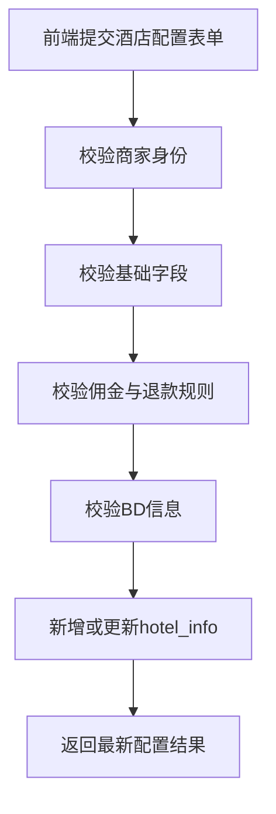
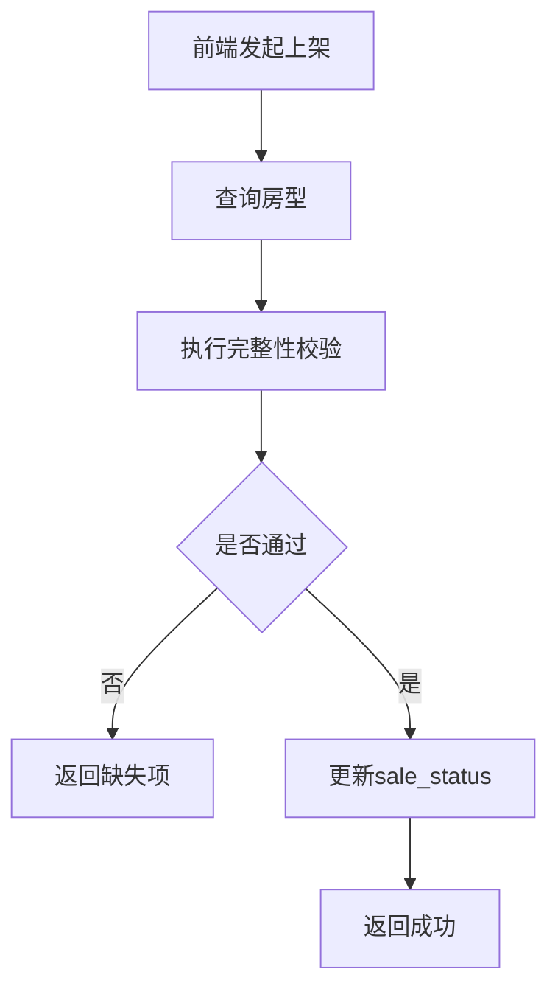
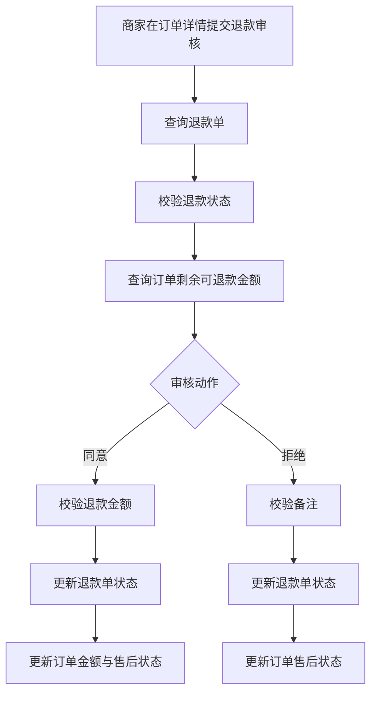
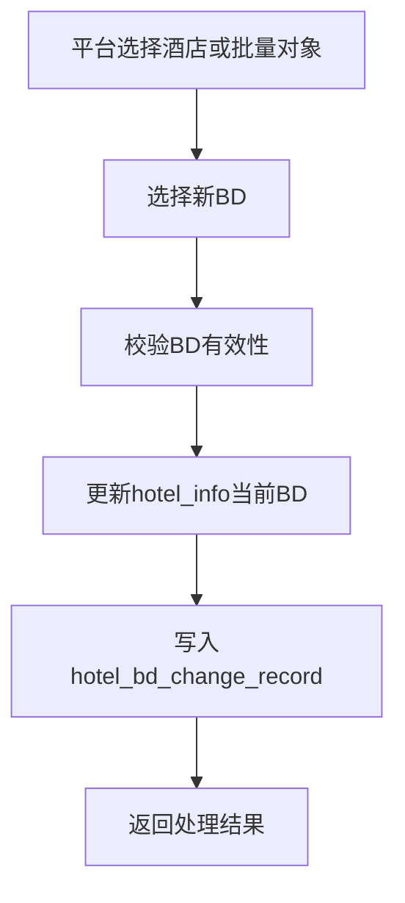

# 酒店商家端技术设计文档

## 1. 文档说明

本文档基于 [`plans/hotel-management-plan.md`](plans/hotel-management-plan.md) 的最新业务方案重构，进一步细化为可执行的技术设计文档，面向若依前后端分离项目落地，覆盖以下内容：

- 前端页面与交互设计
- 后端分层与接口实现建议
- 数据库表设计与落库建议
- 若依权限、字典、菜单与模块落地建议
- 一期实现边界与二期扩展预留

本次技术设计重点与管理方案保持一致：

- 退款能力从独立菜单调整为酒店订单内的售后处理能力
- 酒店配置页统一承载基础信息、佣金模式、专属 BD、BD 电话、退款规则
- 增加更换所属 BD 独立能力，支持平台侧交接操作
- 保持单店商家模型，但所有核心数据结构保留扩展字段

当前项目技术前提如下：

- 后端采用 Spring Boot + Spring Security + MyBatis
- 控制器放在管理端模块
- 业务数据建议落在系统业务模块
- 菜单、权限、字典沿用若依标准能力

---

## 2. 本期技术实现范围

### 2.1 本期实现目标

一期目标为跑通酒店商家端最小经营闭环，包含：

- 酒店信息与经营配置维护
- 房型档案维护
- 房型设施绑定
- 房型默认价格与默认库存管理
- 房型上下架与可预订控制
- 酒店订单查询
- 订单内退款审核与金额处理
- 更换所属 BD 与变更记录查询

### 2.2 本期不做

本期暂不实现以下能力：

- 多店管理
- 日历房态管理
- 平台复核退款
- 自动打款退款
- 渠道分销同步
- 财务结算中心
- BD 绩效结算
- BD 交接审批流

### 2.3 技术实现原则

- 单店模型，但核心表统一保留 `merchant_id` 与 `hotel_id`
- 页面能力优先采用若依标准列表、表单、详情抽屉模式
- 状态字段按业务语义分离，不做混合复用
- 退款入口统一放在订单模块，退款单仍独立存储
- 酒店配置项统一归并，避免多菜单重复维护
- 更换所属 BD 由平台侧操作，商家侧只读展示当前 BD 信息
- 第一阶段以默认库存、默认价格驱动经营管理
- 预留按日房态库存表，不强制一期启用

---

## 3. 总体架构设计

## 3.1 业务模块划分

建议按以下业务域拆分：

- 酒店配置域
- 房型管理域
- 经营库存域
- 订单售后域
- BD 归属域

### 3.1.1 业务职责说明

| 业务域 | 职责 |
|---|---|
| 酒店配置域 | 维护酒店资料、佣金模式、BD 信息、退款规则 |
| 房型管理域 | 维护房型档案、房型设施、上下架完整性 |
| 经营库存域 | 维护默认价格、默认库存、预订开关 |
| 订单售后域 | 查询订单、查询退款记录、执行退款审核 |
| BD 归属域 | 平台侧更换酒店所属 BD、记录交接轨迹 |

## 3.2 技术分层建议

建议新增酒店业务包，统一归入业务模块：

```text
com.yimamerchant.system.domain.hotel
com.yimamerchant.system.mapper.hotel
com.yimamerchant.system.service.hotel
com.yimamerchant.system.service.hotel.impl
com.yimamerchant.system.domain.vo.hotel
com.yimamerchant.system.domain.dto.hotel
com.yimamerchant.system.domain.query.hotel
```

管理端控制器建议放在：

```text
com.yimamerchant.web.controller.hotel
```

### 3.2.1 推荐类清单

#### Domain

- `HotelInfo`
- `HotelRoomType`
- `HotelFacility`
- `HotelRoomTypeFacilityRel`
- `HotelRoomInventory`
- `HotelOrder`
- `HotelRefundOrder`
- `HotelBdChangeRecord`

#### Query / DTO / VO

- `HotelInfoForm`
- `HotelInfoVO`
- `HotelConfigSummaryVO`
- `HotelRoomTypeQuery`
- `HotelRoomTypeForm`
- `HotelRoomTypeVO`
- `HotelRoomTypeDetailVO`
- `HotelRoomTypeCheckVO`
- `HotelFacilityQuery`
- `HotelRoomTypeFacilityForm`
- `HotelInventoryQuery`
- `HotelInventoryPriceForm`
- `HotelInventoryStockForm`
- `HotelInventoryBatchForm`
- `HotelInventoryBookableForm`
- `HotelOrderQuery`
- `HotelOrderVO`
- `HotelOrderDetailVO`
- `HotelRefundApproveForm`
- `HotelRefundRejectForm`
- `HotelRefundRecordVO`
- `HotelBdChangeQuery`
- `HotelBdChangeForm`
- `HotelBdBatchChangeForm`
- `HotelBdChangeRecordVO`

#### Service

- `IHotelInfoService`
- `IHotelRoomTypeService`
- `IHotelFacilityService`
- `IHotelInventoryService`
- `IHotelOrderService`
- `IHotelRefundService`
- `IHotelBdChangeService`

#### Controller

- `HotelInfoController`
- `HotelRoomTypeController`
- `HotelFacilityController`
- `HotelInventoryController`
- `HotelOrderController`
- `HotelRefundController`
- `HotelBdChangeController`

### 3.2.2 控制器职责建议

| 控制器 | 职责 |
|---|---|
| `HotelInfoController` | 酒店信息与经营配置维护 |
| `HotelRoomTypeController` | 房型档案增删改查与上下架 |
| `HotelFacilityController` | 设施查询与房型设施绑定 |
| `HotelInventoryController` | 默认价格库存、可预订状态维护 |
| `HotelOrderController` | 订单列表、订单详情、退款记录聚合展示 |
| `HotelRefundController` | 退款审核执行能力，可作为订单售后子控制器 |
| `HotelBdChangeController` | 平台侧酒店所属 BD 调整与变更记录 |

---

## 4. 前端页面技术设计

## 4.1 页面目录建议

建议前端目录结构如下：

```text
yimamerchant-ui/src/views/hotel/
├─ info/
│  └─ index.vue
├─ roomType/
│  └─ index.vue
├─ inventory/
│  └─ index.vue
├─ order/
│  └─ index.vue
└─ bdChange/
   └─ index.vue
```

接口定义建议放在：

```text
yimamerchant-ui/src/api/hotel/
├─ info.js
├─ roomType.js
├─ facility.js
├─ inventory.js
├─ order.js
└─ bdChange.js
```

## 4.2 酒店信息与经营配置页

页面文件建议：`yimamerchant-ui/src/views/hotel/info/index.vue`

### 4.2.1 页面定位

单表单页面，用于维护当前商家酒店基础资料与经营配置。

### 4.2.2 页面布局建议

- 顶部：页面标题、保存按钮、配置摘要
- 主体：基础信息表单
- 中部：佣金配置板块
- 中部：BD 信息板块
- 中部：退款规则板块
- 底部：酒店简介、预订须知、开票说明、停车说明

### 4.2.3 表单字段

| 字段 | 组件建议 | 是否必填 | 说明 |
|---|---|---|---|
| hotelName | `el-input` | 是 | 酒店名称 |
| hotelCover | 上传组件 | 是 | 封面图 |
| hotelImages | 多图上传 | 否 | 轮播图 |
| phone | `el-input` | 是 | 联系电话 |
| region | 省市区联动 | 是 | 行政区划 |
| address | `el-input` | 是 | 详细地址 |
| longitude | `el-input-number` | 否 | 经度 |
| latitude | `el-input-number` | 否 | 纬度 |
| checkInTime | 时间选择 | 是 | 入住时间 |
| checkOutTime | 时间选择 | 是 | 离店时间 |
| status | `el-radio-group` | 是 | 酒店状态 |
| commissionMode | `el-radio-group` | 是 | 佣金模式 |
| commissionValue | `el-input-number` | 是 | 佣金值 |
| bdUserId | `el-select` | 是 | 专属 BD |
| bdPhone | `el-input` | 是 | BD 电话 |
| refundRuleType | `el-radio-group` | 是 | 退款规则 |
| refundDeadlineDesc | `el-input` | 条件必填 | 限时退款条件 |
| refundRuleDesc | `el-input type=textarea` | 否 | 退款规则说明 |
| intro | `el-input type=textarea` | 否 | 酒店简介 |
| bookingNotice | `el-input type=textarea` | 否 | 预订须知 |
| invoiceDesc | `el-input type=textarea` | 否 | 开票说明 |
| parkingDesc | `el-input type=textarea` | 否 | 停车说明 |

### 4.2.4 交互规则

- 页面初始化查询当前商家酒店信息
- 若不存在数据，页面按新增模式渲染
- 若已存在数据，页面按编辑模式渲染
- 佣金模式切换时联动显示字段说明
- 退款规则切换为限时退时显示限时说明输入框
- 商家侧 BD 字段建议可见但默认只读，若业务允许商家维护则开放编辑

## 4.3 房型管理页

页面文件建议：`yimamerchant-ui/src/views/hotel/roomType/index.vue`

### 4.3.1 页面定位

列表页加新增编辑弹窗，用于维护房型基础档案与设施绑定。

### 4.3.2 页面结构

- 查询区域
- 房型列表表格
- 新增编辑弹窗
- 详情抽屉
- 设施勾选区域

### 4.3.3 页面操作

- 新增
- 编辑
- 查看详情
- 启用停用
- 删除
- 上架下架
- 校验完整性

### 4.3.4 关键交互规则

- 新增与编辑共用弹窗
- 编辑时带出已绑定设施
- 上架前触发后端完整性校验
- 已有关联订单或经营数据时删除按钮置灰或后端拦截

## 4.4 库存价格管理页

页面文件建议：`yimamerchant-ui/src/views/hotel/inventory/index.vue`

### 4.4.1 页面定位

一期采用房型经营列表页，以默认价格和默认库存为核心。

### 4.4.2 页面结构

- 查询区域
- 批量操作区
- 列表表格
- 单行快速编辑弹窗

### 4.4.3 页面操作

- 批量设置价格
- 批量设置库存
- 单行修改价格
- 单行修改库存
- 开启关闭预订
- 跳转房型页执行上架下架

### 4.4.4 关键交互规则

- 支持多选批量调价调库存
- 批量提交前校验金额精度和库存合法性
- 上架下架状态建议调用房型状态接口，避免状态维护分散

## 4.5 酒店订单页

页面文件建议：`yimamerchant-ui/src/views/hotel/order/index.vue`

### 4.5.1 页面定位

列表页加详情抽屉，用于商家查询订单并处理退款。

### 4.5.2 页面结构

- 查询区域
- 订单列表表格
- 订单详情抽屉
- 退款记录区域
- 退款审核弹窗

### 4.5.3 列表字段建议

- 订单编号
- 入住人
- 联系电话
- 房型名称
- 入住日期
- 离店日期
- 订单金额
- 实付金额
- 已退款金额
- 可退款金额
- 订单状态
- 售后状态
- 支付时间
- 操作列

### 4.5.4 退款审核交互规则

- 退款入口统一放在订单详情中
- 详情中同时展示申请退款金额、酒店退款规则、当前可退款金额
- 商家同意退款时必须录入实际退款金额
- 拒绝退款时审核备注必填
- 退款提交成功后刷新订单详情与退款记录区

## 4.6 更换所属 BD 页

页面文件建议：`yimamerchant-ui/src/views/hotel/bdChange/index.vue`

### 4.6.1 页面定位

平台侧列表页，用于酒店归属快速交接。

### 4.6.2 页面结构

- 查询区域
- 酒店归属表格
- 批量操作工具栏
- 更换弹窗
- 变更记录弹窗

### 4.6.3 页面操作

- 查询酒店归属
- 查询可选 BD
- 单个更换所属 BD
- 批量更换所属 BD
- 查看历史变更记录

### 4.6.4 关键交互规则

- 更换所属 BD 前必须二次确认
- 批量更换需展示影响酒店数量
- 成功后刷新酒店归属列表与酒店配置摘要

---

## 5. 前端 API 文件设计

## 5.1 酒店信息接口文件

文件：`yimamerchant-ui/src/api/hotel/info.js`

建议方法：

- `getHotelInfo()`
- `saveHotelInfo(data)`
- `changeHotelStatus(data)`
- `getHotelConfigSummary()`

## 5.2 房型接口文件

文件：`yimamerchant-ui/src/api/hotel/roomType.js`

建议方法：

- `listRoomType(query)`
- `getRoomType(id)`
- `addRoomType(data)`
- `updateRoomType(data)`
- `removeRoomType(id)`
- `changeRoomTypeConfigStatus(data)`
- `changeRoomTypeSaleStatus(data)`
- `checkRoomTypeComplete(id)`

## 5.3 设施接口文件

文件：`yimamerchant-ui/src/api/hotel/facility.js`

建议方法：

- `listFacility(query)`
- `listRoomTypeFacilities(roomTypeId)`
- `saveRoomTypeFacilities(data)`

## 5.4 库存价格接口文件

文件：`yimamerchant-ui/src/api/hotel/inventory.js`

建议方法：

- `listInventory(query)`
- `updateBasePrice(data)`
- `updateBaseStock(data)`
- `batchUpdateInventory(data)`
- `changeBookableFlag(data)`

## 5.5 酒店订单接口文件

文件：`yimamerchant-ui/src/api/hotel/order.js`

建议方法：

- `listOrder(query)`
- `getOrderDetail(id)`
- `listRefundRecords(orderId)`
- `getRefundDetail(refundId)`
- `approveRefund(data)`
- `rejectRefund(data)`

## 5.6 更换所属 BD 接口文件

文件：`yimamerchant-ui/src/api/hotel/bdChange.js`

建议方法：

- `listHotelBdRelation(query)`
- `listBdOptions(query)`
- `changeHotelBd(data)`
- `batchChangeHotelBd(data)`
- `listBdChangeRecord(query)`

---

## 6. 后端实现设计

## 6.1 数据隔离设计

### 6.1.1 商家侧数据隔离

商家侧所有查询和操作必须基于当前登录用户的商家身份进行数据隔离。

建议做法：

- 从登录态解析当前用户编号
- 通过商家绑定关系解析 `merchantId`
- 查询酒店、房型、订单、退款时统一带入 `merchantId`
- 控制器层不信任前端传入的 `merchantId`

### 6.1.2 平台侧数据隔离

平台侧更换所属 BD 接口由平台角色访问。

建议做法：

- 使用角色和权限标识控制访问入口
- 支持按酒店名称、商家编号、当前 BD 查询交接对象
- 记录操作人、操作时间和变更原因

## 6.2 事务边界设计

### 6.2.1 保存酒店信息事务

涉及：

- 保存酒店基础资料
- 保存佣金模式与佣金值
- 保存专属 BD 信息
- 保存退款规则

建议整体放入一个事务中执行。

### 6.2.2 保存房型事务

涉及：

- 保存房型主表
- 保存房型设施绑定

建议整体放入一个事务中执行，避免房型与设施数据不一致。

### 6.2.3 退款审核事务

涉及：

- 校验退款状态
- 更新退款单状态
- 更新订单已退款金额
- 更新订单可退款金额
- 更新订单售后状态
- 写入审核人和审核时间

退款审核必须使用事务，避免退款单与订单金额状态不一致。

### 6.2.4 更换所属 BD 事务

涉及：

- 更新酒店表当前 BD 信息
- 写入 BD 变更记录

建议放入单事务执行，确保当前归属与历史轨迹一致。

## 6.3 核心服务方法建议

### 6.3.1 酒店配置服务

建议方法：

- `getCurrentHotelInfo()`
- `saveHotelInfo(HotelInfoForm form)`
- `changeHotelStatus(Long id, String status)`
- `getHotelConfigSummary()`

### 6.3.2 房型服务

建议方法：

- `selectRoomTypePage(HotelRoomTypeQuery query)`
- `selectRoomTypeDetail(Long id)`
- `insertRoomType(HotelRoomTypeForm form)`
- `updateRoomType(HotelRoomTypeForm form)`
- `deleteRoomType(Long id)`
- `changeConfigStatus(Long id, String configStatus)`
- `changeSaleStatus(Long id, String saleStatus)`
- `checkRoomTypeComplete(Long id)`

### 6.3.3 库存服务

建议方法：

- `selectInventoryPage(HotelInventoryQuery query)`
- `updateBasePrice(HotelInventoryPriceForm form)`
- `updateBaseStock(HotelInventoryStockForm form)`
- `batchUpdateInventory(HotelInventoryBatchForm form)`
- `changeBookableFlag(HotelInventoryBookableForm form)`

### 6.3.4 订单售后服务

建议方法：

- `selectOrderPage(HotelOrderQuery query)`
- `selectOrderDetail(Long id)`
- `selectRefundRecords(Long orderId)`
- `selectRefundDetail(Long refundId)`
- `approveRefund(HotelRefundApproveForm form)`
- `rejectRefund(HotelRefundRejectForm form)`

### 6.3.5 BD 归属服务

建议方法：

- `selectHotelBdRelationPage(HotelBdChangeQuery query)`
- `selectBdOptions(String keyword)`
- `changeHotelBd(HotelBdChangeForm form)`
- `batchChangeHotelBd(HotelBdBatchChangeForm form)`
- `selectBdChangeRecordPage(HotelBdChangeQuery query)`

---

## 7. 核心流程技术设计

## 7.1 酒店配置保存流程



### 技术说明

- 酒店配置作为单表单入口统一提交
- 若商家尚未创建酒店则执行新增，否则执行更新
- BD 名称快照可由后端根据 `bdUserId` 自动回填

## 7.2 房型上架流程



### 技术说明

- 上架校验建议封装为独立方法
- 缺失项返回前端用于友好提示
- 库存页与房型页统一调用同一上架能力

## 7.3 退款审核流程



### 技术说明

- 审核动作必须保证幂等
- 同意退款与拒绝退款共享状态前置校验
- 已退款金额、可退款金额、售后状态要同步更新

## 7.4 更换所属 BD 流程



### 技术说明

- 单个更换与批量更换应复用同一核心服务逻辑
- 批量处理建议逐条写入变更记录
- 如存在失败项，建议返回成功数量、失败数量、失败原因摘要

---

## 8. 数据库设计

## 8.1 命名规范

建议使用以下命名风格：

- 表名前缀统一使用 `hotel_`
- 主键统一使用 `id`
- 删除标记统一使用 `del_flag`
- 创建更新字段沿用若依标准字段
- 状态字段统一使用 `char` 或短 `varchar`
- 金额字段统一使用 `decimal(10,2)`

## 8.2 酒店表 `hotel_info`

建议承载酒店基础资料与经营配置。

### 8.2.1 字段建议

| 字段 | 类型建议 | 说明 |
|---|---|---|
| id | bigint | 主键 |
| merchant_id | bigint | 商家编号 |
| hotel_name | varchar(50) | 酒店名称 |
| hotel_cover | varchar(255) | 封面图 |
| hotel_images | text | 轮播图集合 |
| phone | varchar(20) | 联系电话 |
| province_code | varchar(20) | 省编码 |
| city_code | varchar(20) | 市编码 |
| district_code | varchar(20) | 区编码 |
| address | varchar(255) | 详细地址 |
| longitude | decimal(10,6) | 经度 |
| latitude | decimal(10,6) | 纬度 |
| check_in_time | varchar(10) | 入住时间 |
| check_out_time | varchar(10) | 离店时间 |
| intro | text | 酒店简介 |
| booking_notice | text | 预订须知 |
| invoice_desc | text | 开票说明 |
| parking_desc | text | 停车说明 |
| commission_mode | char(1) | 佣金模式 |
| commission_value | decimal(10,2) | 佣金值 |
| bd_user_id | bigint | 当前 BD 编号 |
| bd_name | varchar(50) | 当前 BD 名称快照 |
| bd_phone | varchar(20) | 当前 BD 电话 |
| refund_rule_type | char(1) | 退款规则类型 |
| refund_rule_desc | varchar(500) | 退款规则说明 |
| refund_deadline_desc | varchar(255) | 限时退款说明 |
| status | char(1) | 酒店状态 |
| del_flag | char(1) | 删除标记 |
| create_by | varchar(64) | 创建者 |
| create_time | datetime | 创建时间 |
| update_by | varchar(64) | 更新者 |
| update_time | datetime | 更新时间 |

### 8.2.2 索引建议

- 唯一索引 `uk_merchant_id` 对应 `merchant_id`
- 普通索引 `idx_bd_user_id` 对应 `bd_user_id`

## 8.3 房型表 `hotel_room_type`

### 8.3.1 字段建议

沿用管理方案中的房型结构，重点字段如下：

- `room_type_name`
- `room_type_code`
- `room_images`
- `bed_type`
- `people_limit`
- `base_price`
- `market_price` 若项目需要划线价可补充
- `base_stock`
- `config_status`
- `sale_status`
- `bookable_flag`

### 8.3.2 索引建议

- 唯一索引 `uk_hotel_room_type_name` 对应 `hotel_id, room_type_name`
- 唯一索引 `uk_hotel_room_type_code` 对应 `hotel_id, room_type_code`
- 普通索引 `idx_merchant_id`
- 普通索引 `idx_hotel_id`

## 8.4 设施表与关联表

### 8.4.1 `hotel_facility`

承载平台标准设施项。

### 8.4.2 `hotel_room_type_facility_rel`

承载房型与设施的多对多关系。

### 8.4.3 实现建议

- 保存关系时采用先删后插
- 增加唯一索引避免重复绑定

## 8.5 房态库存价格表 `hotel_room_inventory` 预留

### 8.5.1 一期策略

- 可以先不启用按日房态表
- 默认库存价格直接使用房型表字段维护

### 8.5.2 二期策略

- 启用 `biz_date` 维度管理库存与价格
- 支持批量调价、批量调库存、停售日配置

## 8.6 订单表 `hotel_order`

### 8.6.1 字段建议

| 字段 | 类型建议 | 说明 |
|---|---|---|
| id | bigint | 主键 |
| order_no | varchar(50) | 订单号 |
| hotel_id | bigint | 酒店编号 |
| merchant_id | bigint | 商家编号 |
| room_type_id | bigint | 房型编号 |
| contact_name | varchar(50) | 联系人 |
| contact_phone | varchar(20) | 联系电话 |
| check_in_date | date | 入住日期 |
| check_out_date | date | 离店日期 |
| order_amount | decimal(10,2) | 订单金额 |
| pay_amount | decimal(10,2) | 实付金额 |
| refunded_amount | decimal(10,2) | 已退款金额 |
| refundable_amount | decimal(10,2) | 剩余可退款金额 |
| order_status | char(1) | 订单状态 |
| after_sale_status | char(1) | 售后状态 |
| pay_time | datetime | 支付时间 |
| create_time | datetime | 创建时间 |
| update_time | datetime | 更新时间 |

### 8.6.2 索引建议

- 唯一索引 `uk_order_no`
- 普通索引 `idx_merchant_id`
- 普通索引 `idx_hotel_id`
- 普通索引 `idx_room_type_id`

## 8.7 退款单表 `hotel_refund_order`

### 8.7.1 字段建议

| 字段 | 类型建议 | 说明 |
|---|---|---|
| id | bigint | 主键 |
| refund_no | varchar(50) | 退款单号 |
| order_id | bigint | 订单编号 |
| order_no | varchar(50) | 订单号 |
| hotel_id | bigint | 酒店编号 |
| merchant_id | bigint | 商家编号 |
| room_type_id | bigint | 房型编号 |
| apply_refund_amount | decimal(10,2) | 申请退款金额 |
| approved_refund_amount | decimal(10,2) | 审核通过退款金额 |
| refund_reason | varchar(500) | 退款原因 |
| refund_status | char(1) | 退款状态 |
| audit_remark | varchar(500) | 审核备注 |
| audit_by | varchar(64) | 审核人 |
| audit_time | datetime | 审核时间 |
| create_time | datetime | 创建时间 |
| update_time | datetime | 更新时间 |

### 8.7.2 实现建议

- 退款单仍独立建表，但页面入口归属订单域
- 审核成功后必须与订单表金额字段联动更新

## 8.8 BD 归属变更表 `hotel_bd_change_record`

### 8.8.1 字段建议

| 字段 | 类型建议 | 说明 |
|---|---|---|
| id | bigint | 主键 |
| hotel_id | bigint | 酒店编号 |
| merchant_id | bigint | 商家编号 |
| old_bd_user_id | bigint | 原 BD 编号 |
| old_bd_name | varchar(50) | 原 BD 名称 |
| old_bd_phone | varchar(20) | 原 BD 电话 |
| new_bd_user_id | bigint | 新 BD 编号 |
| new_bd_name | varchar(50) | 新 BD 名称 |
| new_bd_phone | varchar(20) | 新 BD 电话 |
| change_reason | varchar(500) | 更换原因 |
| effective_time | datetime | 生效时间 |
| operate_by | varchar(64) | 操作人 |
| operate_time | datetime | 操作时间 |

### 8.8.2 索引建议

- 普通索引 `idx_hotel_id`
- 普通索引 `idx_old_bd_user_id`
- 普通索引 `idx_new_bd_user_id`
- 普通索引 `idx_operate_time`

---

## 9. 字典设计

建议在若依字典中新增以下类型：

| 字典类型 | 字典名称 | 建议值 |
|---|---|---|
| `hotel_status` | 酒店状态 | 0草稿 1启用 2停业 3待审核 |
| `hotel_commission_mode` | 佣金模式 | 1底价模式 2卖价模式 |
| `hotel_refund_rule_type` | 退款规则 | 1限时退 2不可退 3任意退 |
| `hotel_room_config_status` | 房型配置状态 | 0未启用 1已启用 |
| `hotel_room_sale_status` | 房型上架状态 | 0已下架 1已上架 |
| `hotel_bookable_flag` | 是否可预订 | Y是 N否 |
| `hotel_bed_type` | 床型 | 1大床 2双床 3圆床 4榻榻米 9其他 |
| `hotel_window_type` | 窗型 | 1有窗 2无窗 3部分有窗 |
| `hotel_facility_type` | 设施分类 | 1房间设施 2卫浴设施 3公共设施 4服务设施 |
| `hotel_order_status` | 订单状态 | 1待支付 2已支付待入住 3入住中 4已完成 5已取消 |
| `hotel_after_sale_status` | 售后状态 | 0无售后 1待退款处理 2部分退款中 3已退款 4退款驳回 |
| `hotel_refund_status` | 退款状态 | 1待商家处理 2商家已同意 3商家已拒绝 4退款处理中 5退款成功 6退款失败 |

---

## 10. 权限与菜单配置设计

## 10.1 菜单结构建议

最终在若依菜单中建议配置：

```text
酒店管理
├─ 酒店信息
├─ 佣金与归属配置
├─ 房型管理
├─ 库存价格管理
├─ 酒店订单
└─ 更换所属BD
```

## 10.2 权限标识建议

### 酒店信息与配置

- `hotel:info:query`
- `hotel:info:edit`
- `hotel:config:commission`
- `hotel:config:bd`
- `hotel:config:refundRule`

### 房型管理

- `hotel:roomType:list`
- `hotel:roomType:add`
- `hotel:roomType:edit`
- `hotel:roomType:remove`
- `hotel:roomType:detail`
- `hotel:roomType:enable`
- `hotel:roomType:putOn`
- `hotel:roomType:putOff`

### 设施配置

- `hotel:facility:list`
- `hotel:facility:bind`

### 库存价格管理

- `hotel:inventory:list`
- `hotel:inventory:edit`
- `hotel:inventory:batchEdit`

### 酒店订单

- `hotel:order:list`
- `hotel:order:detail`
- `hotel:order:refundView`
- `hotel:order:refundApprove`
- `hotel:order:refundReject`
- `hotel:order:refundAmountEdit`

### 更换所属 BD

- `hotel:bdChange:list`
- `hotel:bdChange:update`
- `hotel:bdChange:batchUpdate`
- `hotel:bdChange:record`

---

## 11. 核心实现规则

## 11.1 房型上架校验

建议封装独立方法，例如 `validateRoomTypeCanPutOn`。

校验项：

- 酒店存在且状态允许经营
- 房型配置状态为启用
- 房型图片不为空
- 默认价格大于 0
- 默认库存大于 0
- 房型关键静态字段完整

## 11.2 删除规则

房型删除建议遵循：

- 无订单、无经营数据时允许逻辑删除
- 有订单或库存经营记录时只允许停用，不允许删除

## 11.3 退款审核幂等控制

退款审核操作建议增加状态前置校验：

- 当前状态必须为待商家处理
- 审核完成后再次提交应提示状态已变化
- 同意退款时校验订单剩余可退款金额
- 并发下建议使用状态条件更新或乐观锁机制

## 11.4 更换所属 BD 审计要求

更换所属 BD 必须满足：

- 更新当前归属信息
- 写入原归属和新归属快照
- 记录操作人、操作时间、变更原因
- 批量操作逐条保留变更日志

## 11.5 图片字段处理约定

建议：

- 接口层使用数组
- 服务层统一转为 JSON 字符串存储
- 出参统一反序列化为数组

---

## 12. 开发顺序建议

## 12.1 第一步

先落数据库与字典：

- 建酒店表或扩展酒店表字段
- 建房型表
- 建设施表
- 建房型设施关联表
- 建订单表或对接现有订单表
- 建退款表
- 建 BD 归属变更表
- 初始化字典数据

## 12.2 第二步

落后端基础能力：

- 酒店信息与经营配置接口
- 房型管理接口
- 设施绑定接口
- 库存价格管理接口
- 订单列表与详情接口
- 退款审核接口
- 更换所属 BD 接口

## 12.3 第三步

落前端页面：

- 酒店信息与配置页
- 房型管理页
- 库存价格管理页
- 酒店订单页
- 更换所属 BD 页

## 12.4 第四步

联调与测试：

- 字段映射联调
- 状态流转联调
- 退款金额边界测试
- 批量更换 BD 场景测试
- 操作日志与权限测试

---

## 13. 风险与规避建议

### 13.1 退款入口与实现割裂

规避建议：

- 页面统一从订单进入退款处理
- 数据仍由退款单独立存储
- 订单详情聚合退款记录展示

### 13.2 酒店配置项分散维护

规避建议：

- 基础信息、佣金、BD、退款规则统一在酒店配置页维护
- 服务层统一走酒店配置保存入口

### 13.3 BD 交接后展示不同步

规避建议：

- 更换所属 BD 成功后刷新酒店配置摘要
- 当前归属信息与历史记录分表存储

### 13.4 状态流转复杂导致代码耦合

规避建议：

- 订单状态、售后状态、退款状态分别定义
- 金额计算统一收敛到退款服务中处理
- 状态变更点统一打操作日志

---

## 14. 一期与二期边界说明

### 14.1 一期落地

- 当前商家唯一酒店信息与经营配置维护
- 房型基础档案管理
- 房型设施绑定
- 默认价格、默认库存维护
- 房型上下架与可预订控制
- 酒店订单列表与详情
- 订单内退款处理
- 更换所属 BD 与变更记录

### 14.2 二期预留

- 基于 `hotel_room_inventory` 的按日房态库存与价格管理
- 多店铺管理
- 与订单中心联动扣减库存
- 退款自动打款与平台复核
- 基于佣金模式的自动结算
- BD 交接审批流与历史轨迹增强
